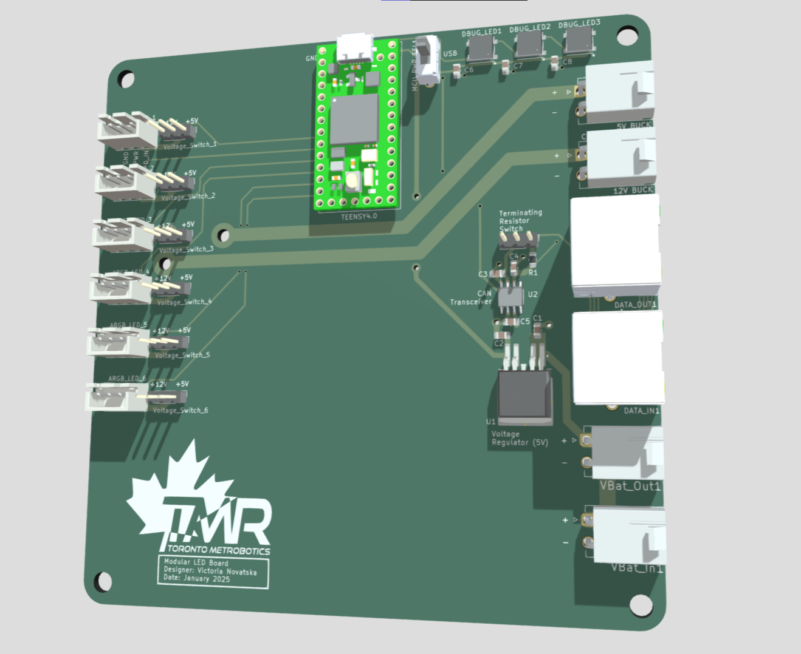
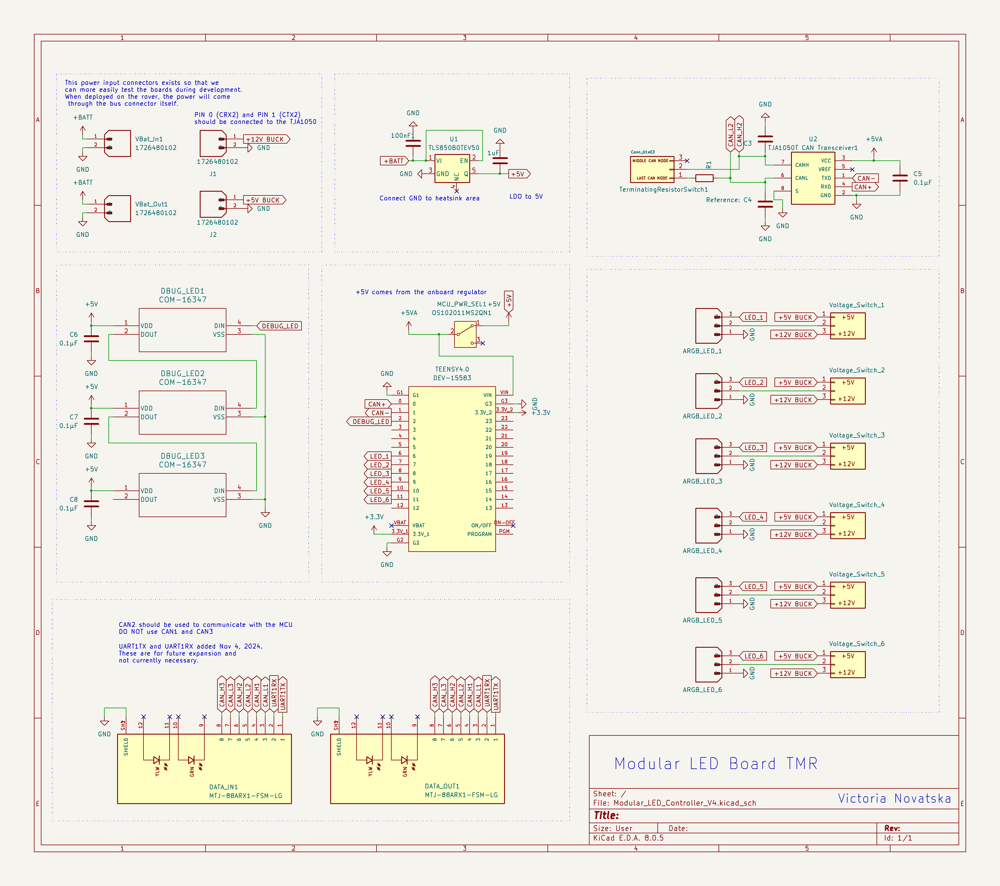

# Modular LED Board TMR
Modular PCB to supply power to and control LED strips, providing input for both 5V and 12V. For the Mars Rover of the Toronto Metropolitan Robotics Team

# [View Interactive 3D Model of my PCB!](https://skfb.ly/pACWx)
 

## Schematic 

